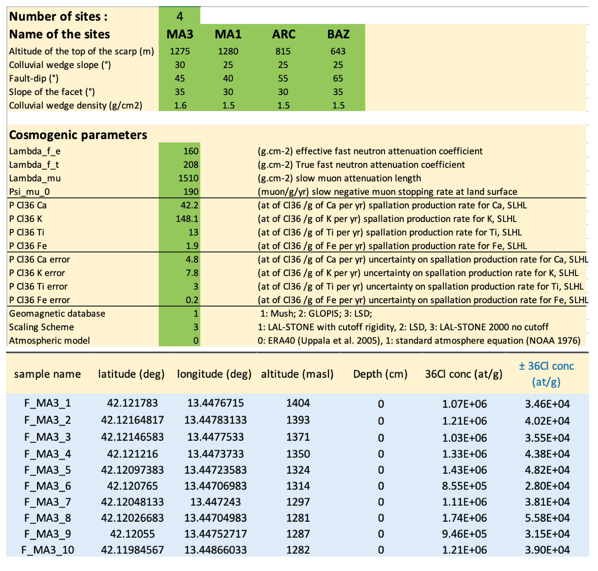
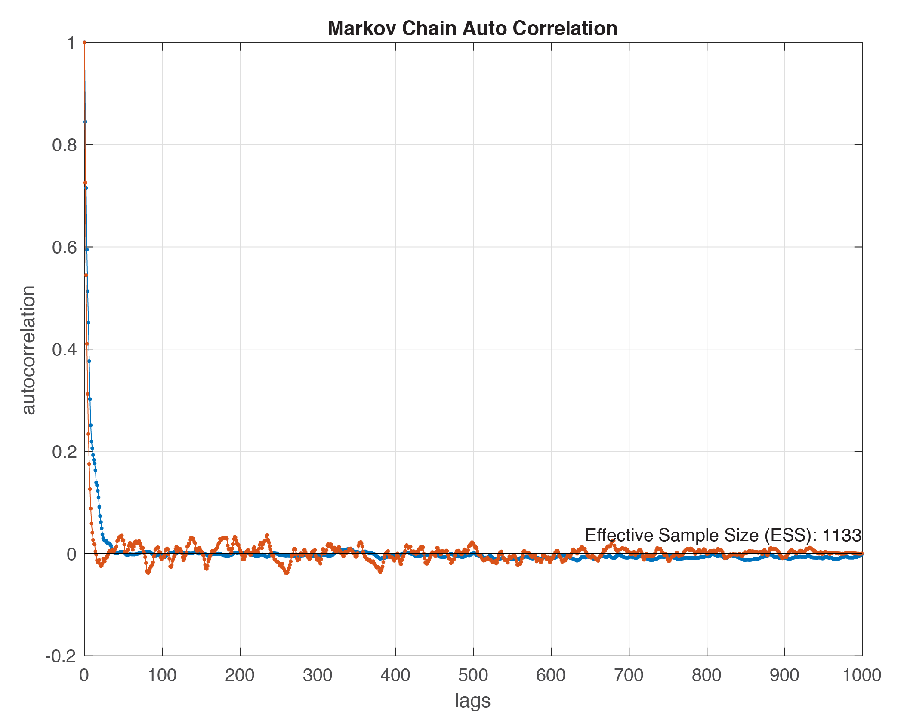
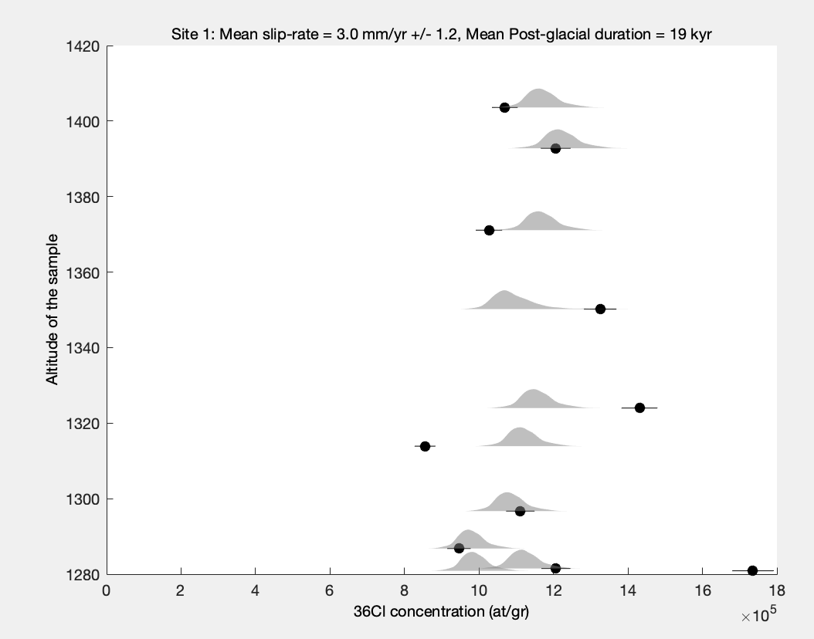

# Getting Started

**ModelFacet** is a Matlab program allowing to model <sup>36</sup>Cl concentrations of rock samples belonging to the surface of a normal fault facet. The program allows to inverse the data using a Monte-Carlo Markov chain algorithm, to constrain two main parameters driving the <sup>36</sup>Cl concentrations within a sample: the fault slip-rate, and the duration of the post-glacial period. The forward model includes various factors that modulate the <sup>36</sup>Cl production rate within the rock, such as the site location, the shielding resulting from the geometry of the facet and associated colluvium, the chemical composition of the fault-plane rock, and the geomagnetic field temporal variations.

# Prerequisites

Using **ModelFacet** requires Matlab (version >=2016), and an .xls file editor.

# How to run an inversion ?

## Data and site parameters

The samples data (chemistry and geographical information) and the parameters describing the site, must be provided by the user in the excel sheet named "**DATA_IN.xlsx**", localized in the "*Input*" folder. The sheet *Parameters* is common to all sites, and describes the geometry of each site, the model and inversion parameters. The name of each site must be provided in this sheet. The chemistry of the samples must be given for each site in a sheet. Each sheet must be called by the name of the site *NameOfTheSite*. This name must corresponds to the site name in the *Parameters* site. It allows the user to provide the chemistry analysis of each sample for a site, including <sup>36</sup>Cl concentration, major and traces, and the localization information. 

## Parameters for the modeling and the Inversion

The parameters used for the modeling of <sup>36</sup>Cl concentrations, and the inversion of the data are summurized in the sheet *Parameters* of the file  "**DATA_IN.xlsx**". 

### Parameters of each site
- number of site : **must be the altitude of the post-glacial scarp top**
- name of the site : **must corresponds to the name of the sheet describing the chemistry of the site**
- Altitude of the site (m)
- Colluvial wedge slope (°)
- Fault-plane dip (°)
- Slope of the facet (°)
- Colluvial wedge density (g/cm2)

### Modeling parameters
- Lambda_f_e : effective fast neutron attenuation coefficient
- Lambda_f_t  : true fast neutron attenuation coefficient
- Lambda_mu  : slow muon attenuation length
- Psi_mu_0 : slow negative muon stopping rate at land surface
- P_Cl36_Ca : spallation production rate for Ca, SLHL
- P_Cl36_K : spallation production rate for K, SLHL
- P_Cl36_Ti : spallation production rate for Ti, SLHL
- P_Cl36_Fe : spallation production rate for Fe, SLHL
- P_Cl36_Ca error : uncertainty on spallation production rate for Ca, SLHL
- P_Cl36_K error : uncertainty on spallation production rate for K, SLHL
- P_Cl36_Ti error  : uncertainty on spallation production rate for Ti, SLHL
- P_Cl36_Fe error : uncertainty on spallation production rate for Fe, SLHL
- Geomag : Choice of the geomagnetic database (1: Mush; 2: GLOPIS; 3: LSD)
- Scaling : Choice of the scaling scheme (1: Time-dependant LAL-STONE with cutoff rigidity, 2: Time-dependant  LSD, 3: Time-independant LAL-STONE 2000 no cutoff)
- Atm : Choice of the Atmospheric model (0: ERA40 (Uppala et al. 2005), 1: standard atmosphere equation (NOAA 1976))

### Inversion parameters 
- Age max : maximum age to compute <sup>36</sup>Cl concentrations produced in sample at depth
- PG_age_0 : initial guess for post-glacial age
- SR_0  : initial guess for the fault slip-rate
- SR_min : minimum slip-rate bound
- SR_max : maximum slip-rate bound
- SR_std : slip-rate standard deviation for proposal function (normal distribution)
- T_min : Inversion minimum post-glacial age bound 
- T_max : Inversion maximum post-glacial age bound 
- T_std  : post-glacial age standartd deviation for proposal function (normal distribution)
- n_walker : number of chain
- n_models_inversion : number of models generated during the inversion
- parallel_computing : use of parallel computing (1:true,0: false)
- N_burnin  :  proportion of the chain removed, must be >= 0 and <1.
- n_plot  : number of samples randomly picked to draw <sup>36</sup>Clconcentrations pdf from the inversion

<p align="center">

</p>

## Running a data inversion

To run an inversion of <sup>36</sup>Cl concentrations, use the following command in the *Matlab* window:
```
Inversion_36Cl_Facet
```
Results of the inversion are placed in  *Results/results_gwmcmc.mat*

### Autocorellation plot : 
After the inversion, check the Markov chain autocorellation plot to be sure the algorithm has converged and produced uncorrelated models. Be sure the proportion of models removed from the chains is large enough to remove the whole burnin period.

<p align="center">

</p>

### Posterior probability density plot : 
The program will also produce the posterior pdf plot for each parameters:

<p align="center">

</p>

### Posterior probability density of modeled <sup>36</sup>Cl concentrations : 
The program provide the plot of modeled <sup>36</sup>Cl concentrations of 1000 models randomly selected in the Markov chains.

<p align="center">

</p>


# How to test a forward model ?
To model the <sup>36</sup>Cl concentrations of a given model, indicates the input parameters (slip-rate and post-glacial duration) in the frame *Test a forward model* in the sheet *Parameters* of the xls setting file.
Run the following command in the *Matlab* window:
```
Inversion_36Cl_Facet
```
<p align="center">

</p>


# How to plot results from an inversion

If needed, the results from an inversion can be plotted again using the following command:
```
Plot_results_inversion.m
```
Be sure the results from the inversion are present in the *Result* folder (file  *results_gwmcmc.mat* ).

